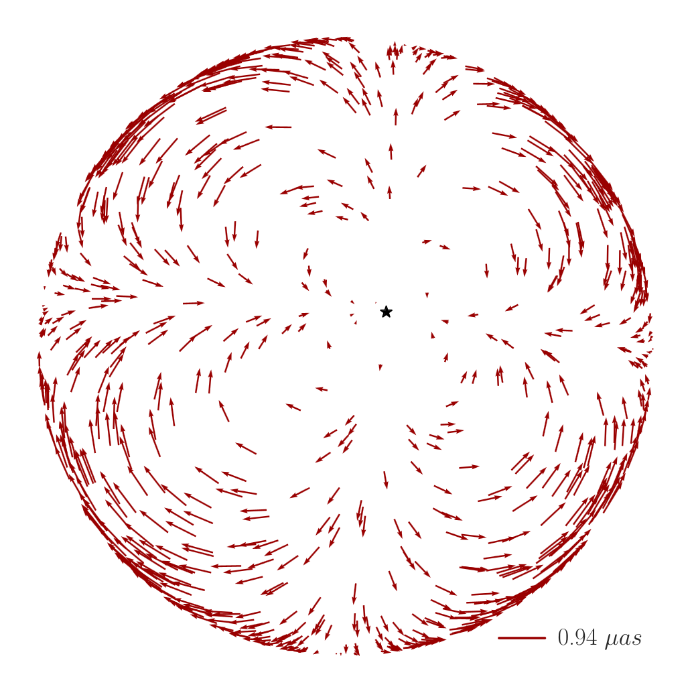

## About me

I'm a physics PhD student at the University of Southern California, working with [Prof. Kris Pardo](http://kpardo.com/). My current research interests are in novel methods to detect gravitational waves, and in probing the large-scale structure of the universe.

I'm also interested in using GPUs to speed up scientific computation, applying [automatic differentiation](https://en.wikipedia.org/wiki/Automatic_differentiation) to the same, and generally making computers go fast.

In my spare time, I like to hike, play complicated board games, and read entirely too much science fiction (read Greg Egan btw).

## Research

### Gravitational waves

With [Prof. Kris Pardo](http://kpardo.com/), I am investigating a novel method of detecting gravitational waves in the microhertz range, using relative stellar astrometry -- i.e., seeing stars change apparent position on the sky due to a passing gravitational wave. 

This deflection is many orders of magnitude smaller than our ability to resolve stellar positions, so my focus is on new methods to search large (terabyte-scale) amounts of data for a gravitational wave signal efficiently.

|  | 
|:--:| 
| Apparent deflection in stellar position across a hemisphere of the night sky, from a gravitational wave source at the black star. Modified from [Wang+21](https://ui.adsabs.harvard.edu/abs/2021PhRvD.103h4007W). |

### Large-scale structure

With [Prof. Khee-Gan Lee](https://sites.google.com/view/kglee/home), I am exploring applications of probing the large-scale structure of the universe (the "cosmic web") at cosmological redshifts of 1-2 (7-9 billion years before today) using Lyman-alpha tomography.

<!-- - **Computer Vision:** image recognition, image generation, video captioning
- **Machine Learning:** meta-learning, incremental learning, transfer learning

## News

- **[Feb. 2020]** Our paper about incremental learning is accepted to CVPR 2020.
- **[Feb. 2020]** We will host the ACM Multimedia Asia 2020 conference in Singapore!
- **[Sept. 2019]** Our paper about few-shot learning is accepted to NeurIPS 2019.
- **[Mar. 2019]** Our paper about few-shot learning is accepted to CVPR 2019.



 -->
